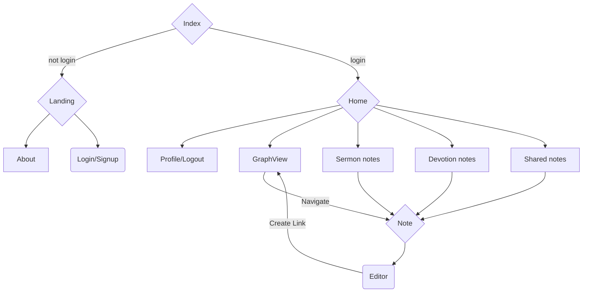

# Manna Jar
A note-taking website/application for Chinese Christians.
Support size: 360px-1920px
## Link
[manna-jar.web.app](https://manna-jar.web.app/)

---*Experience Manna Jar without sign up*---

Id: john@gmail.com / Password: john12345
## Features
- **AutoVerse**: An automatic biblical scripture input feature with an [open API](https://bible.fhl.net/json/), supporting various biblical abbreviation formats.
- **BackLinks**: A bidirectional note references using [Quill-mention](https://github.com/quill-mention/quill-mention).
- **GraphView**: Create with [React graph vis](https://www.npmjs.com/package/react-graph-vis), enabling users to navigate corresponding notes by clicking nodes.
- **AI summary**: Generates belief summaries based on recent notes and recommends review-worthy notes, leveraging the [OpenAI API](https://openai.com/blog/openai-api).
- **Share Via Links**: Enabled sharing articles with a link, with safeguards against duplicate collections and self-sharing.
- **Fontsize Switch**: Switch display fontsize of note for better reading experience.
## Tech Stack

 

## Flow Chart

## Demo

## Contact
[LinkedIn](https://www.linkedin.com/in/yu-chien-yang-fe) / email: yuuchien.yang@gmail.com
