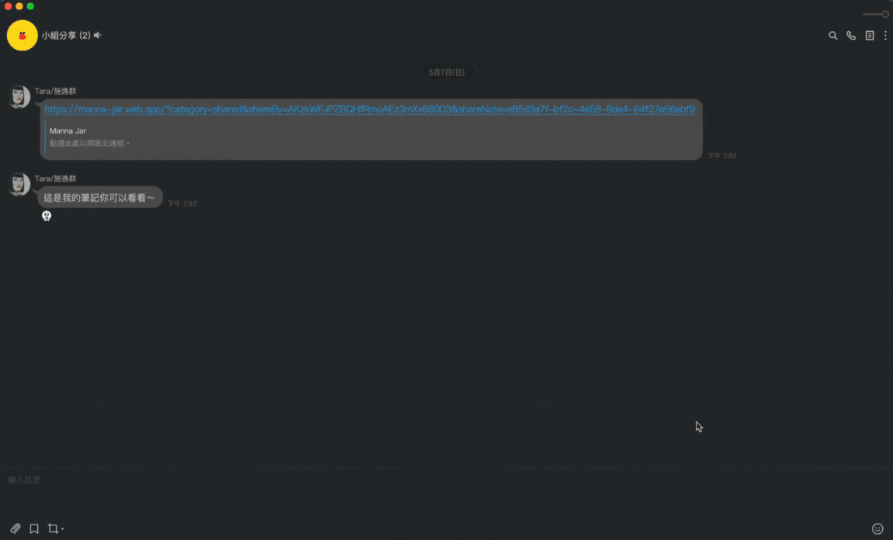

  <a href="https://manna-jar.web.app/" style="margin-bottom:30px; margin-top:30px; display:block;"> 
    <h1>嗎 哪 罐 子</h1>
  </a>

  

  

    <a href="https://www.linkedin.com/in/yu-chien-yang-fe">About Me</a>
    |
    <a href="https://manna-jar.web.app/">Manna Jar</a>
    |
    <a href="https://youtu.be/XIifHA6auQI">Demo</a>
  

## Manna Jar
A note-taking website/application for Chinese Christians.
Support size: 360px-1920px
- **AutoVerse**: An automatic biblical scripture input feature with an [open API](https://bible.fhl.net/json/), supporting various biblical abbreviation formats.
- **BackLinks**: Broaden your view to see this note in other contexts. Link relevant pages with one click.
- **GraphView**: The graph is your knowledge at a glance, lets you visualize the relationships between the notes in your vault and enabling navigate corresponding notes by clicking nodes.
- **AI summary**: Generates belief summaries based on recent notes and recommends review-worthy notes.
- **Share Via Links**: Enabled sharing articles with a link, with safeguards against duplicate collections and self-sharing.
- **Fontsize Switch**: Switch display fontsize of note for better reading experience.
## Link
[manna-jar.web.app](https://manna-jar.web.app/)

---*Experience Manna Jar without sign up*---

Id: john@gmail.com / Password: john12345
## About
- Utilized **Redux / RTK** for systematic state management, separated sync/async event logic with **Thunk**.
- Implemented **TypeScript** to ensure strict type checking to prevent development issues.
- Collaborated with **chatGPT** to develop *AutoVerse*, an automatic biblical scripture input feature using Regex and an [open API](https://bible.fhl.net/json/).
- Integrated *BackLinks*, a bidirectional note references using [Quill-mention](https://github.com/quill-mention/quill-mention), a well-designed data structure, and **Firestore** database, allowing for the creation of referenced lists on the front-end.
- Generated *GraphView* using [React graph vis](https://www.npmjs.com/package/react-graph-vis) and a designed data structure. Enabling users to navigate corresponding notes by clicking nodes. Handled node size and relevance filtering on the front-end.
- Integrated *AI summary* feature with [OpenAI API](https://openai.com/blog/openai-api).
- Enabled article *sharing via links*, including note data from the sharer through URLs.
- Implemented *font size switching* by updating CSS variables with **setProperty API**.
- Maintained user login status using **Firebase Auth** and **localStorage**.
- Employed **TailwindCSS** and **ClassNames** for efficient CSS management.

## Tech Stack

 

## Flow Chart

## Demo
1. **AutoVerse**:Insert Bible Verse's easily into your notes just by typing them out. supporting various biblical abbreviation formats.
 
2. **BackLinks**: A bidirectional note referencing, allowing users to easily create references by typing "#" and selecting note titles from a dropdown. The feature also supports searching for specific notes.

3. **GraphView**: The graph is your knowledge at a glance, lets you visualize the relationships between the notes in your vault and enabling navigate corresponding notes by clicking nodes.

4. **Fontsize Switch**: Switch display fontsize of note for better reading experience.

5. **Share Via Links**: Enabled sharing articles with a link, with safeguards against duplicate collections and self-sharing.

